# deeplearningcfp

Overview: 

- This code was made to read a charity data csv and train a machine learning to predict whether applicants for fundign will be successful. 
- Once the initial code was done a follow up code was made in an attempt to boost the accuracy rate to higher than 75%.

Results: 

Data Preprocessing

-What variable(s) are considered the target(s) for your model?
   
    Starting Code:
        The variable we are focusing on is ["IS_SUCCESSFUL"] column 
       
    Optimized Code: 
        Same as Starting Code
        
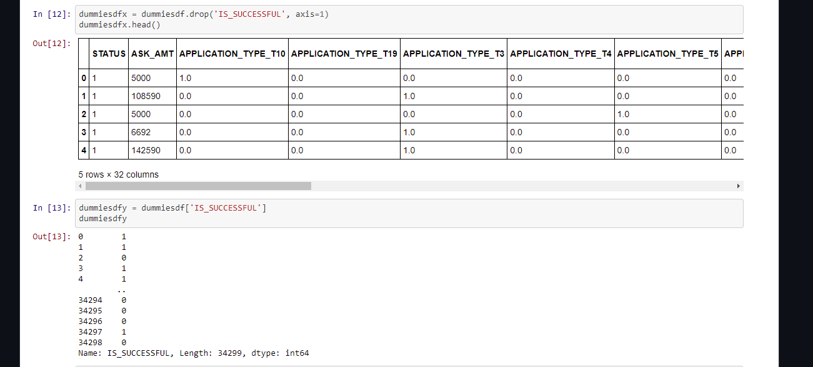

-What variable(s) are considered to be the features for your model?

     Starting Code: 
         ['APPLICATION_TYPE', 'AFFILATION', 'CLASSIFICATION', 'STATUS', 'INCOME_AMT', 'ASK_AMT','ORGANIZATION','SPECIAL_CONSIDERATIONS']
         
 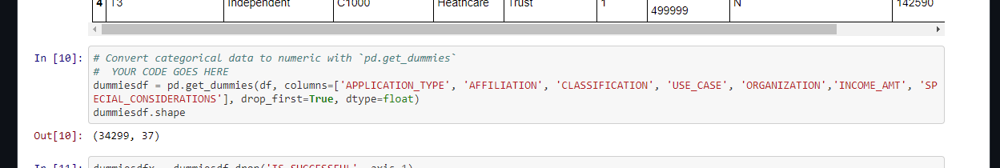
     
     Optimized Code:
         On all three attempts ['APPLICATION_TYPE', 'AFFILATION', 'CLASSIFICATION', 'STATUS', 'INCOME_AMT', 'ASK_AMT'] were the features of the models
         
 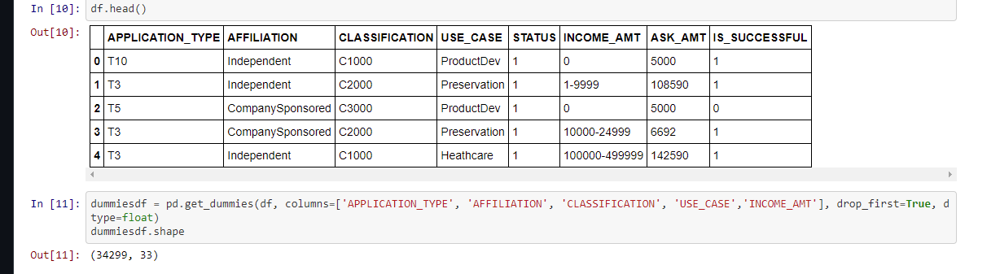

-What variable(s) are neither targets nor features, and should be removed from the input data?
   
    Starting Code: 
        The columns ['EIN'] anmd ['NAME'] were dropped as they held no use 
        
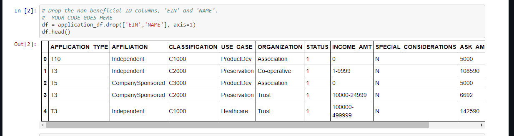
        
    Optimized Code:
        Same as Starting Code
         

Compiling, Training, and Evaluating the Model

-How many neurons, layers, and activation functions did you select for your neural network model, and why?

    Starting Code:
    Three layers were used with the first having 50 units and input dim=36 having a relu activation. The second layer having 30 units and having 
    a relu activation and the last being a sigmoid activation with 1 unit. The reason for using this was to stay simple and produce a "simple" 
    result that can be used as a jumping off point for later optimization. 
    
    
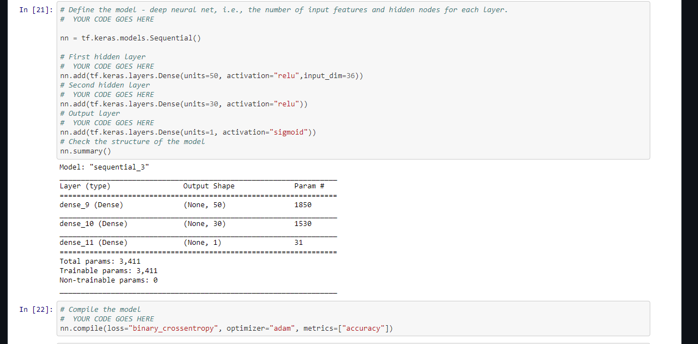
   
    Optimized Code:
    With the optimized code, I attempted the optimization three time.
    
    -Attempt 1: Same as the starting code with the only difference being the input_dim=32 
    
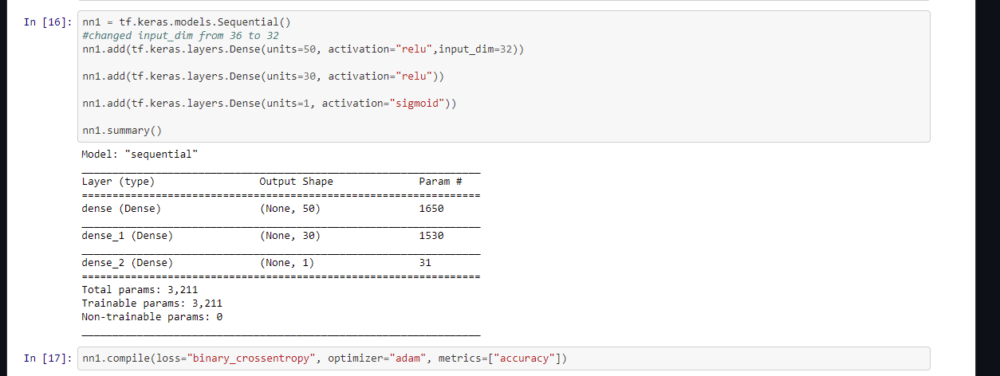
    
    -Attempt 2: Five layers were used with the first four layers being relu activation and the last layer being sigmoid activation. The increase in layers
                 was an attempt to increase accuracy above 75% but did not work. The activation was kept similar to the previous attempt as to keep things simple
                 and because relu cna help speed up the training. 
                 
    
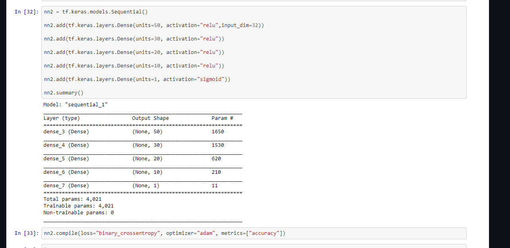
    
    -Attemp 3: This is where things changed. Instead of using a similar method as the previous attempts, here I applied a create_model function and used kerastuner
                to make an auto optimization. Five layers were used with an input_dim=28 and min_value=1 and max_value=50 for each iteration and the code ran through 
                relu, tanh, and sigmoid to find the best results. The reason why I used auto optimization for the last attempt was due to how my previous attempts yielded
                little change to accuracy and by applying a code where it optimizes itself I hoped to find one model that could predict higher than 75%. 
                
    
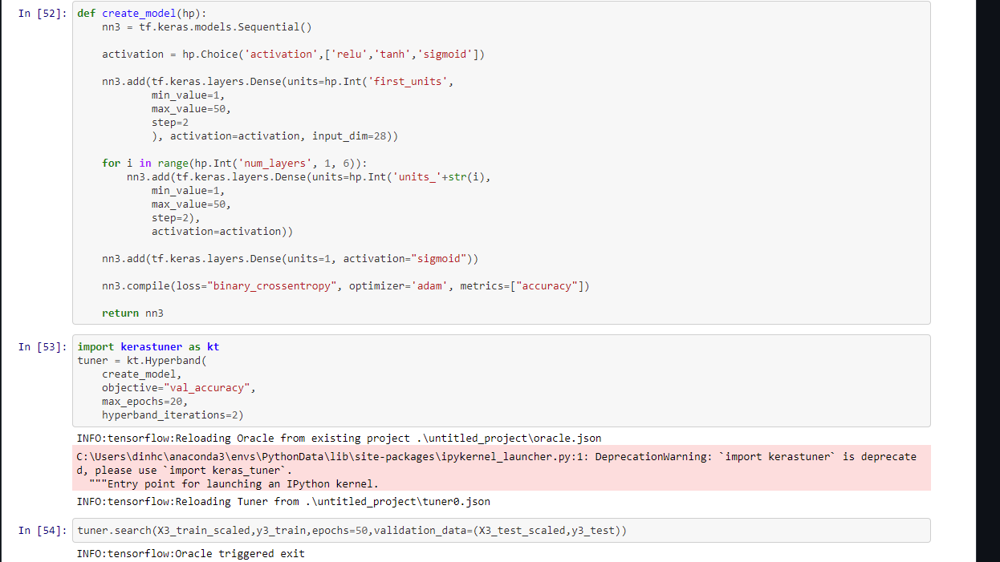

-Were you able to achieve the target model performance?

    Starting Code: 
    
    No. The accuracy for the beginning code was 0.72 
    
    
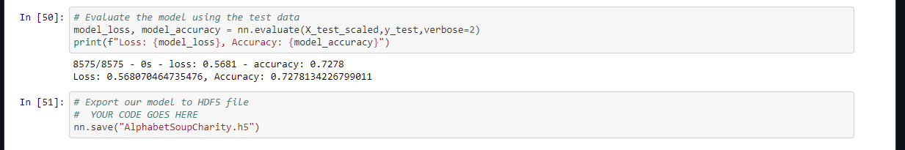
    
    Optimized Code:
    
    -Attempt 1: No, but accuracy was rasied to 0.734
    
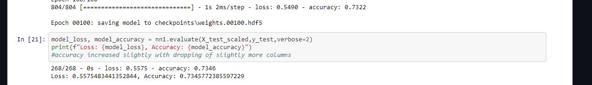
    
    -Attempt 2: No, accuracy was 0.735
    
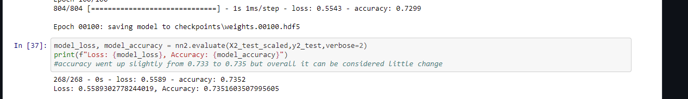
    
    -Attempt 3: No, accuracy was 0.735
    
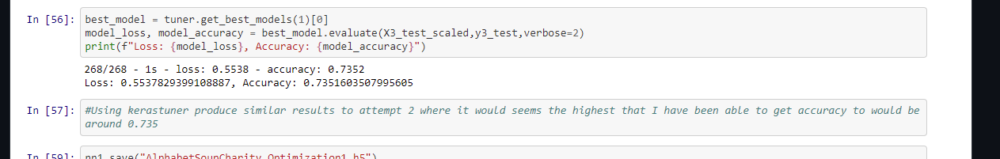

-What steps did you take to try and increase model performance?
    
    Optimized Code: 
    
    -Attempt 1: Simple change where more columns were Dropped. Dropped ['EIN', 'NAME','ORGANIZATION', 'SPECIAL_CONSIDERATIONS']
    
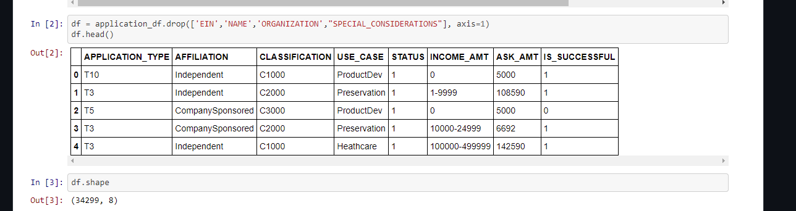
    
    -Attempt 2: Dropped the same columns as attempt 1 but then applied more layers 
    
    

    
    -Attempt 3: Dropped the same columns as attempt 1 but then employed an autooptimization code to run and find the best model. 
    
    

Summary: Summarize the overall results of the deep learning model. Include a recommendation for how a different model could solve this classification problem, and explain your recommendation.

      - Overall the codes were not able to produce an acurracy score of higher than 75%. With the optimization the accuracy jumped up from 0.72 to 0.73
         which is not much. In terms of reccommending a different model, I would say that the next model should remove AFFILIATION due to it being an unncessary column
         in my opinion unless we are also looking at how the affiliation plays a role in success. Th ASK_AMT and APPLICATION_TYPE columns may need to be reexamined to                    potentially remove or consider the outliers such as T3 having a value count of 27037 for APPLICATION_TYPE while for ASK_AMT 5000 has a value count of 25398 compared
         to everything else in the column only having a value count of 3, 2, or 1. This might help in prepping te data and may increase the accuracy
         slightly though it is unknown whether it would increase past higher than 75% as I would think that the accuracy might only increase by at most 1% or as little 
         as .03% based on my results.
